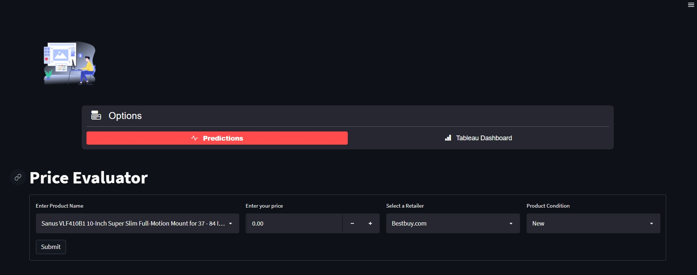
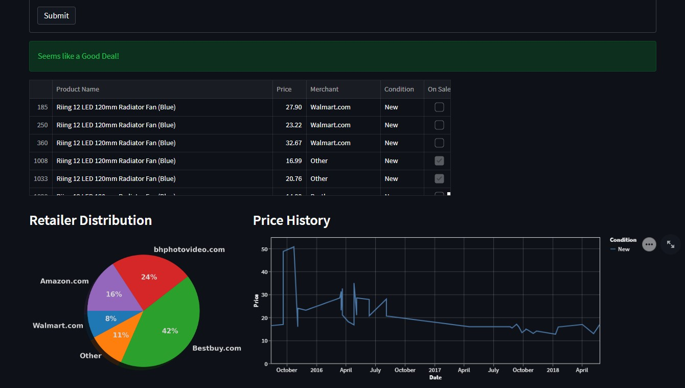
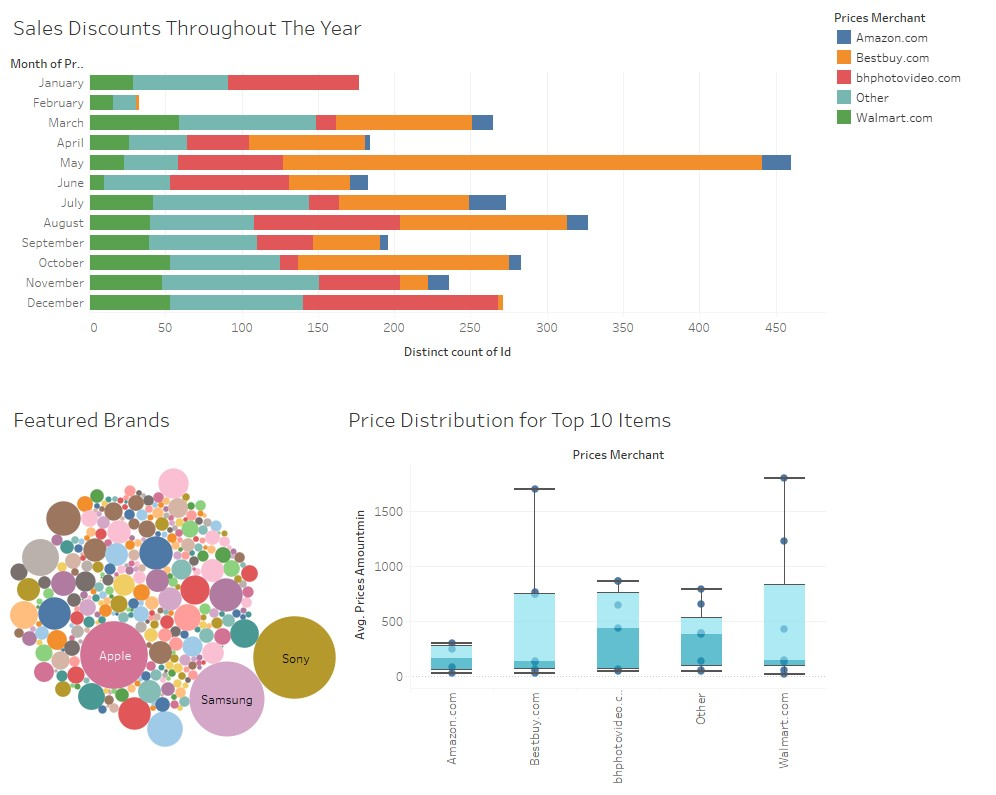
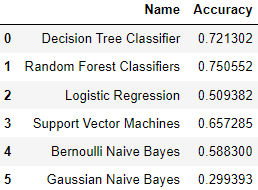

# The Price Evaluator App
### A Streamlit app that not only predicts whether you're getting a discounted price, but also gives a list of deals offered at other top retailers.
There is always a lot of "head knowledge" regarding the best times to buy a certain item (i.e. always wait till Black Friday) or from where to buy it (according to my dad Best Buy is always the best) but there’s rarely any hard evidence to back these claims. The Price Evaluator app uses a machine learning model to predict whether you’re getting a good deal on something, or whether you should shop around some more or wait for a sale.

['Click here to visit our site']()

## The Prediction Page

The application itself is incredibly simple to use. A user simply needs to begin typing the product they are interested in purchasing into the search box and select it from the dropdown menu. After that, enter the price into the adjacent 'Price' box and select whether it is 'New' or 'Used'. Our Machine Learning model will immediately make a prediction and a text box will appear either telling you that it 'Seems like a Good Deal!' in green letters, or that the 'Price may not be Discounted.' in yellow letters, prompting users to consider shopping around more. In either case, the app will also provide a table with all of the observed prices for the selected product, as well as a pie chart with the retailer distribution on this product, and a line graph showing the historical trend in prices. 

## Tableau Dashboard

We also included static visualizations capturing the full dataset in order to tell the story behind our unfiltered data. 
- A stacked bar chart shows the distribution of sales discounts over time; we can see that sales discounts appear most frequently in May, but are least prevalent in Febrary.  
- The Bubble chart shows the distribution of brands in our data set. Sony, Apple and Samsung are pretty big players!
- The Box and Whiskers plot looks at how skewed the pricing data is. In order to evaluate this we chose the top 10 items with the most pricing data associated with them. We can see that Walmart and Bestbuy's average price is quite a bit lower than the other merchants'. BestBuy and Walmart also have the largest spread of pricing within their own data sets, while Amazon remains fairly tight around the mean. For this plot, outliers were thrown out; we are only interested in the skew and shape of normally distributed data.

## Data - Extract, Transform & Load
### Extract: 
We obtained [Electronic Products and Pricing Data](https://www.kaggle.com/datasets/datafiniti/electronic-products-prices?resource=download) from [kaggle.com](kaggle.com) which includes minimum selling prices (`prices_amountmin`) observed from various online merchants (`prices_merchant`) as well as the dates that those prices were observed (`prices_dateseen`), and whether the prices observed were "sale" prices (`prices_issale`) for each individual product id (`id`). 

### Transform:
In order to clean the data, we had to perform several steps
1. Replaced all periods in column names with underscores.
2. Updating all date columns to be in datetime format.
    - `prices_dateseen` - This column originally included all dates that the price was observed. We decided to only keep the most recent date as it represented the most relevant information.
    - To extract these dates, we split the comma-separated column into individual columns and dropped all but the most recent column. 
4. We only kept data that was denomiated in USD; all other currencies were dropped.
5. `prices_condition` - Using RegEx, we split the data between 'New' vs 'Used' (including 'pre-owned', 'refurbished', etc). We assumed that all blanks were 'New'.
6. `prices_merchant` - This column initially was a mess, and included mispellings, odd naming conventions, and a host of other issues, which resulted in over 1,500 unique names. Using RegEx, we split the data between the 4 most commonly observed retailers (Walmart, Bestbuy, Amazon, bhphotovideo) and binned the remaining retailers into an 'Other' category.

### Load:
We decided to use Amazon Web Services (AWS) to host our PostgreSQL RDS. In order to ensure that everyone always had the most up-to-date version version of the data, each time anyone performed any data cleaning in our `Data_ETL.ipynb` file (data cleaning was an ongoing process!), we used the `sqlalchemy` library's `create_engine` function to connect to our database, drop the existing data, and replace it with the newest & cleanest version of the data.

## Machine Learning
### Feature Selection & Target:
The following Features were selected for our Machine Learning model:
1. `id` - The identifier for each unique product.
2. `prices_amountmin` - The lowest price observed for a product on the date specified.
3. `prices_condition` - The 'condition' of a product (i.e. 'New' or 'Used').
4. `prices_merchant` - The merchant selling the product (i.e. 'Walmart.com', 'Bestbuy.com', etc).

Our Target variable is the `prices_issale` field, which indicates whether each data point represents a 'discounted' or 'on-sale' price point.

Note: We initially included the `prices_dateseen` (the date on which the `prices_amountmin` was observed) as a feature in our machine learning model (also experimenting with only keeping the `quarter` or `month` as the feature). However, we eventually realized that this created some over-fitting as our dataset is broken out to thousands of products, while each unique product `id` is only observed, on average, approximately 10-15 times. Once we removed the date features from our model, our accuracy increased by ~5%.

### Data Preprocessing:
We used the `sklearn` library's `LabelEncoder` and `StandardScaler` to preprocess our selected feature and target variables. Additionally, because of the class imbalance observed in our pricing data (discounted prices were far less common than standard prices), we utilized `imblearn.over_sampling.RandomOverSampling` to create an equal distribution in our training data set. We also used the `joblib` library to save our encoders and scalers for future use in our Price Evaluator App.

### Model Selection:
Using our preprocessed dataset, we used a `for` loop to test a number of machine learning models from the `sklearn` library:

Based on these results, we found that the `RandomForestClassifier` provided the highest model accuracy score (`model.score()`). We then used the `joblib` library again to save the trained model for future use in our Price Evaluator App.

## Price Evaluator App
We used Streamlit.io to create and deploy our web application. At the top of our app, we use a `streamlit_option_menu` to allow users to navigate between the 'Predictions' page (default) vs the 'Tableau Dashboard' page. 

On the Prediction page, we use Streamlit's built in `st.form` function to generate a user form which prompts the user for a product name, price, merchant, and condition ('New' or 'Used') and saves them as variables upon the user clicking the "Submit" button. Our app then imports `ML_Evaluator.py` which has a function reads the input variables, loads our Machine Learning model (including data encoders and scaler), and predicts whether the sale conditions are discounted. Based on the output of this function, we use Streamlit's built in `st.success` and `st.warning` functions to generate either a green 'success' box, indicating that the input 'Seems like a Good Deal!' or a yellow 'warning' box, indicating that the input 'May not be Discounted' (we also added `st.balloons` when deals were predicted to be discounted.) 

Upon loading the web application, Streamlit also connects to our AWS database using the `sqlalchemy` library's `create_engine` function (database password stored / retrieved using Streamlit's `st.secrets`), and loads the data as a Pandas dataframe. Using the `.loc` function, we are able to disply only the data that is relevant to the user. We further use both the `matplotlib` and `altair` libraries to generate interactive visualizations based on this filtered dataframe.

On the Tableau Dashboard page, we use `streamlit.components.v1` in order to open our Tableau Public's html embed code, and display our dashboard as a `component` on our website.

## Technology
- Data Cleaning: Pandas, Numpy, and re
- Database: PostgreSQL RDS hosted on AWS
- Machine Learning: Sklearn, Imblearn and Joblib
- Code Editors: Jupyter Notebook / Google Colab / VScode
- Dashboard: Streamlit, Lottie, Matplotlib, Altair, Tableau, HTML
